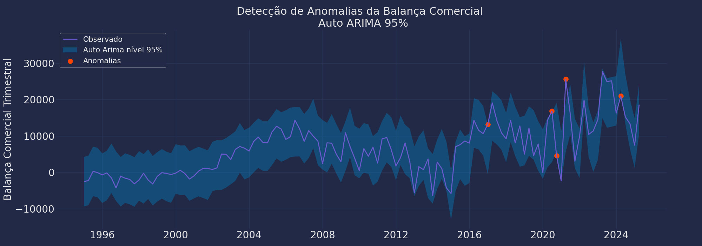

# Transações Correntes Insights

Um projeto desenvolvido durante atividades de contabilidade social, consegui mesclar aprendizados que venho acrescentando em análise de dados com python e também ligar a conteúdos que tenho na faculdade.

Requirements: O Foco do nosso projeto estava em detalhar a evolução dos fluxos das diferentes rubricas que compõem o resultado na balanca de pagamentos.

Bonus: Também desenvolvi em um segundo momento uma análise sobre anomalias nos dados de transações, analisando toda série temporal da balanca comercial mas agora com dados **trimestrais**.

## Nossa Apresentacao do projeto

* Slides (Apresentação do trabalho): [📑 Veja a apresentação de slides](./figures/ContabilidadeSocial%20-%20Balanço%20de%20Pagamentos.pdf)

* Principais insights:
    - Transações Correntes (Saldo Anual): Em 2005, conseguimos notar o pico no saldo positivo histórico. E por sua vez a queda no saldo inicia-se em 2007. Atingindo sua máxima no saldo negativo em 2014.
    - Transações Correntes (Receita e Despesa): Oferece a visão entre receitas e despesa. Em 2014 identificamos onde a receita vs a despesa mais se distanciou; sendo o primeiro defícit da balanca comercial desde 2000.
    - Serviços (Receita e Despesa): Forte despesa com aluguel de equipamentos representando 26%.
    - Exportação/Importação é muito mais volátil e inclusive pode subir em períodos de crise (devido ao impacto na diminuição da renda das importações)

* Arquivo (Código da análise): [.ipynb Arquivo das análises](./Insights/transaction.ipynb)

## Bonus - Análise de anomalias e tendências dos dados.

#### Primeira coisa que estamos fazendo é analisaar se a nossa série tem uma autocorrelacao entre sí, ou uma correlacao parcial. 

Autocorrelation:

* Para entender primeiro autocorrelacao, precisamos analisar alguns exemplos do que é uma autocorrelacao; sendo o relacionamento entre a própria série, ela é basicamente mensurada olhando o que aconteceu no t-1 (um periodo antes), se o periodo antes tem forte impacto do periodo de hoje, pode se deduzir que o periodo de (t) sendo atual, poderá influenciar (t+1) período de amanha, se os dados seguem este comportamento temos uma autocorrelacao, sendo medida e mensurada entre 0 e 1 (representando em porcentagem), no nosso caso é de: **69.51% que é significante para nossa análise**.

* Pois ajuda a identificarmos padrões como sazonalidade, tendências e persistência do valor ao longo do tempo.

Partial Autocorrelation:

* Autocorrelacao parcial é mensurada na observacao entre dois periodos no tempo, contabilizando todas as observacoes nos intervalos mais curtos. Ajudando a isolar a relacao direta entre observacoes em diferentes defasagens (níveis), removendo influências de observacoes intermediárias.

#### Em segunda instância, olhamos as anomalias e tentativa de predicoes

1. Em segunda instância está em analisar as anomalias dentro do intervalo do nosso modelo de AutoArima, onde conseguimos pegar eventos incomuns nos dados trimestrais:

  

2. Buscando entender o que aconteceu durante essas datas encontradas, com as datas respectivas: [csv com as datas encontradas](./data/anomalies_bc.csv)

3. Agora vamos usar esses dados para fazer buscar com **Gemini**, utilizando uma API, para entender melhor, você irá precisar de uma conexão com API do google, precisa criar uma chave para isso [Gemini API Keys](https://ai.google.dev/gemini-api/docs?hl=pt-br).

4. Depois de gerar sua API, você pode criar um arquivo para guardar essa chave, no meu exemplo estou usando o 'config.py' ele está armazenando para mim a variável que contem minha chave de acesso. Ela permitirá fazer as requisicoes via API, para conseguir utilizar o modelo.

    4.1 Você pode olhar o exemplo de como estou fazendo isso, que estou importando este arquivo para ler a chave (com a variavel API_KEY = 'minha chave aqui'). Então você irá criar o seu .py com seu esse nome, ou outro nome que preferir. (mas lembre caso mude, de fazer as alteracoes no arquivo de consulting.py).
    Porque será lá que ele irá ler a chave e conseguir se comunicar com API do gemini.

5. Já no arquivo **consulting.py**, estamos recebendo os dados de anomalias que fizemos na análise de deteccao, pegando os pontos encontrados. Com isso fazemos a consulta, para estruturar nossa pesquisa, do que estava acontecendo nesses períodos. 

    5.1 Conseguimos gerar um mini-relatório dos dados encontrados, acessando por meio de pesquisa dentro do gemini:
    [csv com as datas encontradas](./data/insights.csv)

